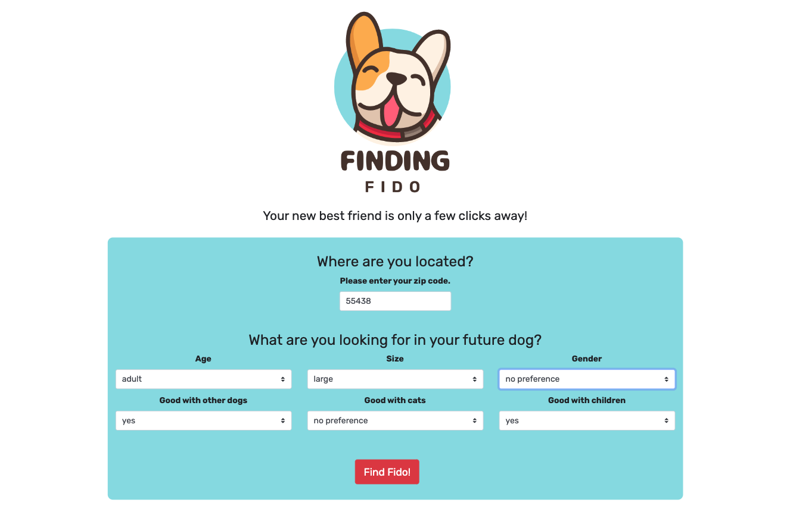
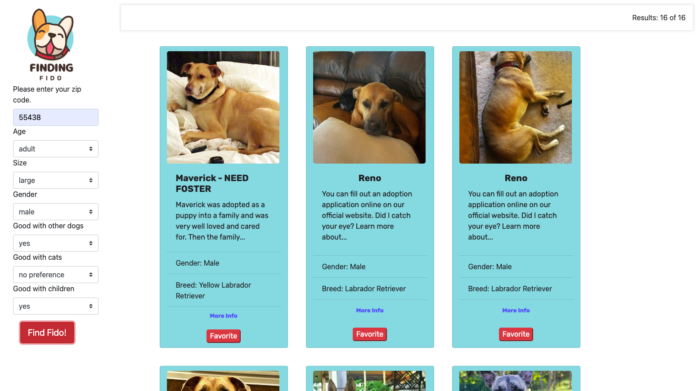
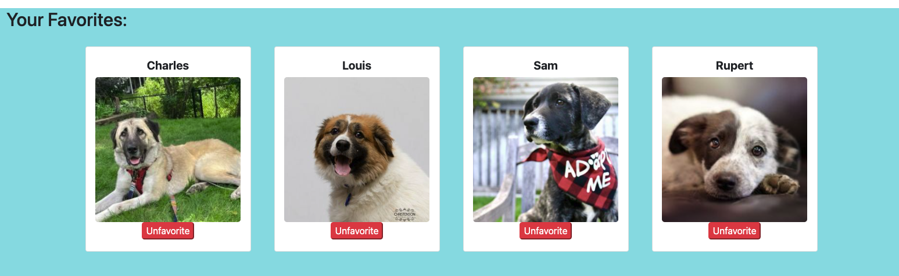

# Finding Fido

## Description

Finding Fido is a web application that utilizes the Petfinder API. Data is retrieved from the API after the user enters information on the main page of the UI and selects the search button. The retrieved data is displayed in the form of a search results page, with inidividual search results inside cards. Each card houses information about a particular dog that is awaiting adoption. The user has the ability to save and remove dogs from a favorites section.

The web application features a dynamically updated UI using HTML, CSS, and JavaScript. It also uses the GreenSock Animation Platform, the Bootstrap CSS framework, jQuery, Google Fonts, and Font Awesome. 

As dog lovers, our motivation for development is believing every dog deserves a loving home. We created an intuitive tool, making it easy for the user to find dogs in need in their area.

## Team Members

The team behind Finding Fido includes the following collaborators:

* Holly Hoffman (Project Manager)
* Jared Mabus
* Joey Krieger
* Shannon Dann

## Usage

The Finding Fido UI is easy to use and features 3 main components:

First, the user is presented with a form followed by a "Find Fido!" search button and a section with optional links to volunteer with or donate to the Humane Society of the United States.
* The form includes a field for the user to enter their zip code and to select search parameters. The search parameters are characteristics about the dog and include age, size, gender, whether they're good with other dogs, whether they're good with cats, and whether they're good with children. 
* The only required field is the zip code. The other search criteria may be left blank for a broader search.

Upon selecting the "Find Fido!" search button, the user is brought to a search results page. 
* This page features search results matching the user's search criteria, which display as individual cards containing information about each dog. 
* The cards contain an image of the dog, their name, gender, and breed. They also contain a link to the dog on the Petfinder website, which includes detailed information and the ability to start an inquiry for adoption.

A favorites section appears at the bottom of the search results page and allows the user to organize and manage information about dogs they're interested in.
* Each card has a button for the user to select if they wish to save the dog to their favorites.
* When the user favorites a dog, the dog is saved to the favorites section that the user can view and update as needed.
* The dog's name and image appear in the favorites section, with a button to unfavorite and remove it.

## Credits

Petfinder For Developers

## Link to Deployed Website

[Finding Fido]()

## License

MIT License

Copyright (c) 2022 Finding Fido

Please refer to the license in the repo for more information.